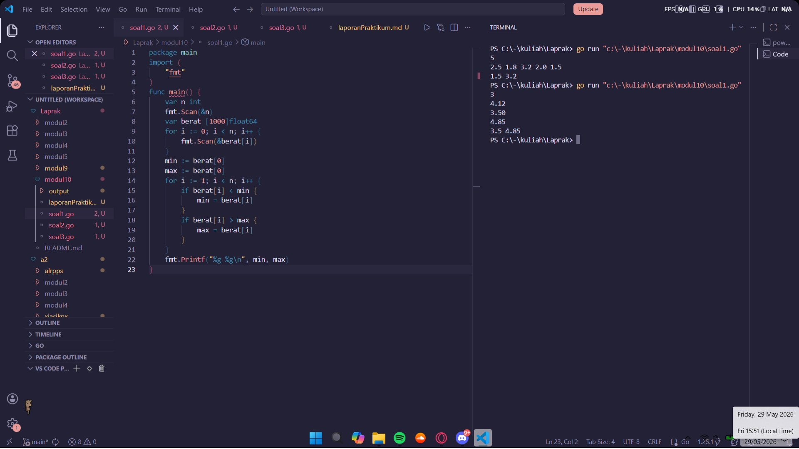
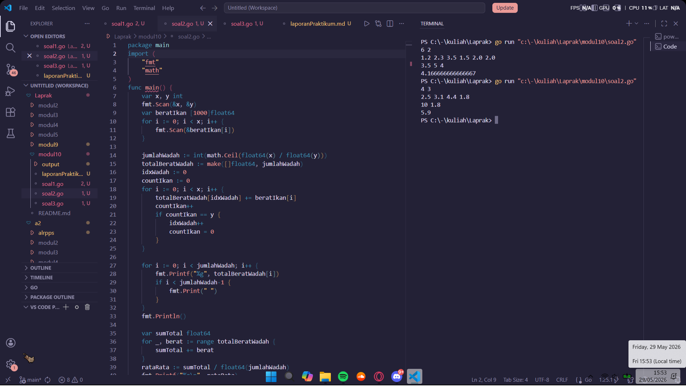

# <h1 align="center">Laporan Praktikum Modul 10 - PENCARIAN NILAI MAX/MIN </h1>
<p align="center">Satriya Wahyu Prakoso - 109082500219</p>

## Unguided 

### 1. Soal1
#### soal1.go

```go
package main
import (
	"fmt"
)
func main() {
	var n int
	fmt.Scan(&n)
	var berat [1000]float64
	for i := 0; i < n; i++ {
		fmt.Scan(&berat[i])
	}
	min := berat[0]
	max := berat[0]
	for i := 1; i < n; i++ {
		if berat[i] < min {
			min = berat[i]
		}
		if berat[i] > max {
			max = berat[i]
		}
	}
	fmt.Printf("%g %g\n", min, max)
}
```
### Output Unguided :

##### Output 


##### Penjelasan

Program ini digunakan untuk mencari dan menampilkan berat badan terkecil serta berat badan terbesar dari sejumlah data berat badan yang dimasukkan. Program ditulis menggunakan bahasa Go.

package main digunakan agar program dapat dijalankan. import "fmt" digunakan untuk melakukan proses input dan output.

Pada fungsi main, pertama dibuat variabel n bertipe integer untuk menyimpan jumlah data berat badan yang akan dimasukkan. Nilai n dibaca menggunakan fmt.Scan(&n).

Selanjutnya dibuat array berat bertipe [1000]float64 yang digunakan untuk menyimpan data berat badan. Program kemudian menggunakan perulangan for sebanyak n kali untuk membaca setiap data berat badan dan menyimpannya ke dalam array berat.

Setelah seluruh data dimasukkan, program membuat variabel min dan max bertipe float64. Kedua variabel ini diinisialisasi dengan nilai elemen pertama array (berat[0]) sebagai nilai awal pembanding.

Program kemudian melakukan perulangan mulai dari indeks ke-1 hingga indeks ke-n-1. Pada setiap iterasi, program membandingkan nilai berat[i] dengan nilai min dan max saat ini.

Jika berat[i] lebih kecil dari min, maka nilai min diperbarui dengan berat[i]. Sebaliknya, jika berat[i] lebih besar dari max, maka nilai max diperbarui dengan berat[i].

Setelah seluruh data selesai diperiksa, program menampilkan nilai min dan max menggunakan fmt.Printf("%g %g\n", min, max). Nilai pertama yang ditampilkan adalah berat badan terkecil, sedangkan nilai kedua adalah berat badan terbesar dari seluruh data yang telah dimasukkan.

### 2. Soal2
#### soal2.go

```go
package main
import (
	"fmt"
	"math"
)
func main() {
	var x, y int
	fmt.Scan(&x, &y)
	var beratIkan [1000]float64
	for i := 0; i < x; i++ {
		fmt.Scan(&beratIkan[i])
	}

	jumlahWadah := int(math.Ceil(float64(x) / float64(y)))
	totalBeratWadah := make([]float64, jumlahWadah)
	idxWadah := 0
	countIkan := 0
	for i := 0; i < x; i++ {
		totalBeratWadah[idxWadah] += beratIkan[i]
		countIkan++
		if countIkan == y {
			idxWadah++
			countIkan = 0
		}
	}

	for i := 0; i < jumlahWadah; i++ {
		fmt.Printf("%g", totalBeratWadah[i])
		if i < jumlahWadah-1 {
			fmt.Print(" ")
		}
	}
	fmt.Println()

	var sumTotal float64
	for _, berat := range totalBeratWadah {
		sumTotal += berat
	}
	rataRata := sumTotal / float64(jumlahWadah)
	fmt.Printf("%g\n", rataRata)
}
```
### Output Unguided :

##### Output 


##### Penjelasan

Program ini digunakan untuk menghitung total berat ikan pada setiap wadah serta rata-rata berat seluruh wadah berdasarkan data berat ikan yang dimasukkan. Program ditulis menggunakan bahasa Go.

package main digunakan agar program dapat dijalankan. import "fmt" digunakan untuk melakukan input dan output, sedangkan import "math" digunakan untuk memanfaatkan fungsi matematika, yaitu math.Ceil().

Pada fungsi main, pertama dibuat variabel x dan y bertipe integer. Variabel x menyatakan jumlah ikan yang akan dimasukkan, sedangkan y menyatakan kapasitas maksimum ikan dalam setiap wadah. Nilai kedua variabel tersebut dibaca menggunakan fmt.Scan(&x, &y).

Selanjutnya dibuat array beratIkan bertipe [1000]float64 untuk menyimpan berat masing-masing ikan. Program menggunakan perulangan for sebanyak x kali untuk membaca data berat ikan dan menyimpannya ke dalam array.

Setelah seluruh data ikan dimasukkan, program menghitung jumlah wadah yang diperlukan menggunakan rumus math.Ceil(float64(x) / float64(y)). Fungsi Ceil() digunakan untuk membulatkan hasil pembagian ke atas sehingga semua ikan dapat ditampung, termasuk jika terdapat sisa ikan yang tidak memenuhi satu wadah penuh.

Kemudian dibuat slice totalBeratWadah bertipe []float64 dengan ukuran sebanyak jumlah wadah yang telah dihitung. Slice ini digunakan untuk menyimpan total berat ikan pada setiap wadah.

Program menggunakan variabel idxWadah untuk menunjukkan indeks wadah yang sedang diisi dan variabel countIkan untuk menghitung jumlah ikan yang telah dimasukkan ke dalam wadah tersebut. Melalui perulangan for, setiap berat ikan ditambahkan ke total berat wadah yang sesuai.

Setiap kali jumlah ikan dalam suatu wadah telah mencapai kapasitas maksimum (countIkan == y), program berpindah ke wadah berikutnya dengan menambah nilai idxWadah dan mengembalikan countIkan menjadi 0.

Setelah semua ikan dikelompokkan ke dalam wadah, program menampilkan total berat masing-masing wadah menggunakan perulangan for. Nilai total berat setiap wadah dicetak dan dipisahkan dengan spasi.

Selanjutnya dibuat variabel sumTotal bertipe float64 untuk menghitung jumlah seluruh berat dari semua wadah. Program menggunakan perulangan for _, berat := range totalBeratWadah untuk menjumlahkan total berat setiap wadah ke dalam sumTotal.

Setelah itu, program menghitung rata-rata berat wadah dengan rumus sumTotal / float64(jumlahWadah) dan menyimpannya ke dalam variabel rataRata.

Terakhir, program menampilkan nilai rata-rata berat wadah menggunakan fmt.Printf("%g\n", rataRata).

### 3. Soal3
#### soal3.go

```go
package main
import (
	"fmt"
)

type arrBalita [100]float64
func hitungMinMax(arrBerat arrBalita, n int, bMin, bMax *float64) {
	*bMin = arrBerat[0]
	*bMax = arrBerat[0]

	for i := 1; i < n; i++ {
		if arrBerat[i] < *bMin {
			*bMin = arrBerat[i]
		}
		if arrBerat[i] > *bMax {
			*bMax = arrBerat[i]
		}
	}
}

func rerata(arrBerat arrBalita, n int) float64 {
	var total float64 = 0
	for i := 0; i < n; i++ {
		total += arrBerat[i]
	}
	return total / float64(n)
}

func main() {
	var n int
	var dataBerat arrBalita
	var min, max float64
	fmt.Print("Masukan banyak data berat balita : ")
	fmt.Scan(&n)
	if n <= 0 || n > 100 {
		return
	}
	for i := 0; i < n; i++ {
		fmt.Printf("Masukan berat balita ke-%d: ", i+1)
		fmt.Scan(&dataBerat[i])
	}
	hitungMinMax(dataBerat, n, &min, &max)
	rataRata := rerata(dataBerat, n)
	fmt.Printf("Berat balita minimum: %.2f kg\n", min)
	fmt.Printf("Berat balita maksimum: %.2f kg\n", max)
	fmt.Printf("Rerata berat balita: %.2f kg\n", rataRata)
}
```
### Output Unguided :

##### Output 
.png)

.png)

##### Deskripsi Program

Program ini digunakan untuk mengolah data berat badan balita, yaitu dengan mencari berat minimum, berat maksimum, dan rata-rata berat balita berdasarkan data yang dimasukkan. Program ditulis menggunakan bahasa Go.

package main digunakan agar program dapat dijalankan, sedangkan import "fmt" digunakan untuk melakukan proses input dan output.

Di luar fungsi main, dibuat tipe data baru bernama arrBalita yang merupakan array bertipe float64 dengan kapasitas maksimal 100 elemen. Tipe data ini digunakan untuk menyimpan data berat badan balita.

Program memiliki fungsi hitungMinMax yang bertugas mencari nilai berat minimum dan maksimum dari data yang ada. Fungsi ini menerima parameter berupa array berat balita, jumlah data, serta dua parameter pointer (bMin dan bMax) yang digunakan untuk mengembalikan hasil pencarian nilai minimum dan maksimum.

Di dalam fungsi hitungMinMax, nilai minimum dan maksimum awal diisi dengan elemen pertama array. Selanjutnya program melakukan perulangan mulai dari indeks ke-1 hingga data terakhir. Jika ditemukan nilai yang lebih kecil dari nilai minimum saat ini, maka nilai minimum diperbarui. Jika ditemukan nilai yang lebih besar dari nilai maksimum saat ini, maka nilai maksimum diperbarui.

Selain itu, terdapat fungsi rerata yang digunakan untuk menghitung rata-rata berat balita. Fungsi ini menerima array berat balita dan jumlah data sebagai parameter. Program menjumlahkan seluruh data berat menggunakan perulangan for, kemudian hasil jumlah tersebut dibagi dengan banyaknya data dan dikembalikan sebagai nilai rata-rata.

Pada fungsi main, pertama dibuat variabel n bertipe integer untuk menyimpan jumlah data balita yang akan dimasukkan. Selain itu dibuat variabel dataBerat bertipe arrBalita untuk menyimpan data berat badan balita, serta variabel min dan max bertipe float64 untuk menyimpan hasil pencarian berat minimum dan maksimum.

Program kemudian menampilkan pesan untuk meminta jumlah data balita, lalu membaca nilainya menggunakan fmt.Scan(&n). Jika nilai n kurang dari atau sama dengan 0, atau lebih dari 100, maka program langsung berhenti menggunakan perintah return karena jumlah data tidak valid.

Jika jumlah data valid, program menggunakan perulangan for sebanyak n kali untuk meminta dan membaca berat badan setiap balita. Setiap data yang dimasukkan disimpan ke dalam array dataBerat.

Setelah seluruh data berhasil dimasukkan, program memanggil fungsi hitungMinMax untuk mencari berat minimum dan maksimum. Hasilnya disimpan ke dalam variabel min dan max melalui parameter pointer.

Selanjutnya program memanggil fungsi rerata untuk menghitung rata-rata berat balita dan menyimpan hasilnya ke dalam variabel rataRata.

Terakhir, program menampilkan berat balita minimum, berat balita maksimum, dan rata-rata berat balita menggunakan fmt.Printf. Nilai ditampilkan dengan format %.2f sehingga hasil memiliki dua angka di belakang koma dan disertai satuan kilogram (kg).