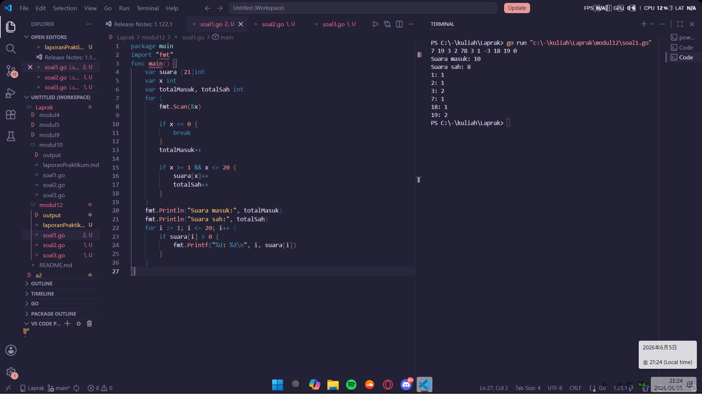
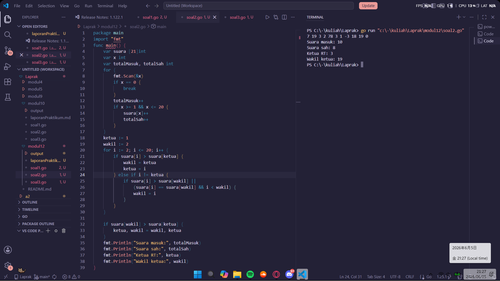
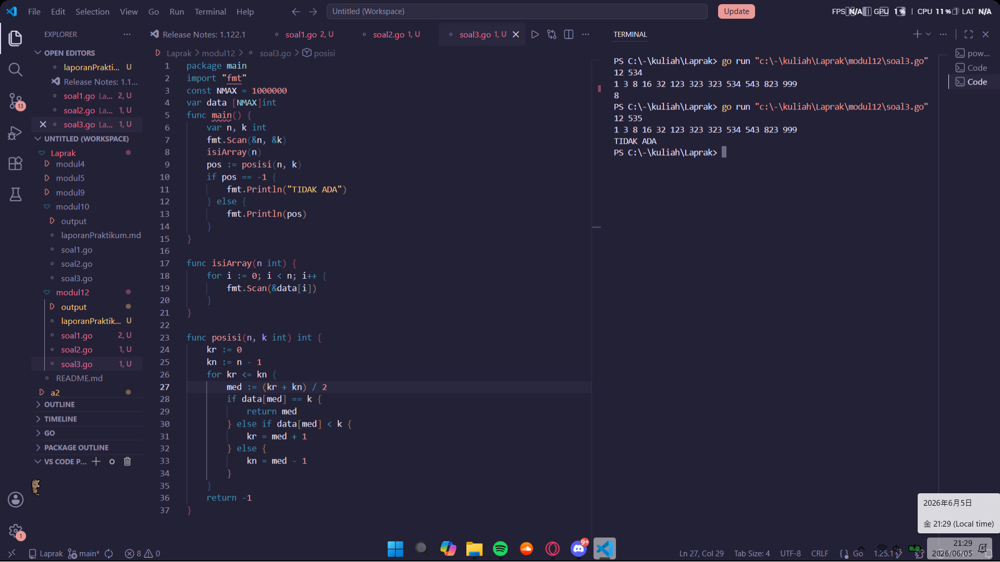

# <h1 align="center">Laporan Praktikum Modul 12 - SEARCHING</h1>
<p align="center">Satriya Wahyu Prakoso - 109082500219</p>

## Unguided 

### 1. Soal1
#### soal1.go

```go
package main
import "fmt"
func main() {
	var suara [21]int
	var x int
	var totalMasuk, totalSah int
	for {
		fmt.Scan(&x)

		if x == 0 {
			break
		}
		totalMasuk++

		if x >= 1 && x <= 20 {
			suara[x]++
			totalSah++
		}
	}
	fmt.Println("Suara masuk:", totalMasuk)
	fmt.Println("Suara sah:", totalSah)
	for i := 1; i <= 20; i++ {
		if suara[i] > 0 {
			fmt.Printf("%d: %d\n", i, suara[i])
		}
	}
}
```
### Output Unguided :

##### Output 


##### Penjelasan

Program ini digunakan untuk membaca, memvalidasi, dan menghitung jumlah suara dalam pemilihan ketua RT. Program ditulis menggunakan bahasa Go.

package main digunakan agar program dapat dijalankan, sedangkan import "fmt" digunakan untuk proses input dan output.

Pada fungsi main, dibuat array suara bertipe [21]int untuk menyimpan jumlah suara setiap calon bernomor 1 sampai 20, variabel x untuk membaca data suara, lalu totalMasuk dan totalSah untuk menghitung jumlah suara masuk dan suara sah.

Program membaca data menggunakan perulangan for hingga ditemukan nilai 0 sebagai penanda akhir masukan. Setiap data selain 0 akan menambah nilai totalMasuk.

Selanjutnya program memeriksa apakah nilai yang dibaca berada pada rentang 1 sampai 20. Jika valid, jumlah suara calon tersebut pada array suara akan ditambah satu dan nilai totalSah juga bertambah satu.

Setelah seluruh data selesai dibaca, program menampilkan jumlah suara masuk dan jumlah suara sah. Kemudian dilakukan perulangan dari calon nomor 1 sampai 20 untuk menampilkan nomor calon yang memperoleh suara beserta jumlah suara yang diterimanya.

### 2. Soal2
#### soal2.go

```go
package main
import "fmt"
func main() {
	var suara [21]int
	var x int
	var totalMasuk, totalSah int
	for {
		fmt.Scan(&x)
		if x == 0 {
			break
		}
		totalMasuk++
		if x >= 1 && x <= 20 {
			suara[x]++
			totalSah++
		}
	}
	ketua := 1
	wakil := 2
	for i := 2; i <= 20; i++ {
		if suara[i] > suara[ketua] {
			wakil = ketua
			ketua = i
		} else if i != ketua {
			if suara[i] > suara[wakil] ||
				(suara[i] == suara[wakil] && i < wakil) {
				wakil = i
			}
		}
	}

	if suara[wakil] > suara[ketua] {
		ketua, wakil = wakil, ketua
	}
	fmt.Println("Suara masuk:", totalMasuk)
	fmt.Println("Suara sah:", totalSah)
	fmt.Println("Ketua RT:", ketua)
	fmt.Println("Wakil ketua:", wakil)
}
```
### Output Unguided :

##### Output 


##### Penjelasan

Program ini digunakan untuk membaca, memvalidasi, dan menghitung suara dalam pemilihan ketua RT, kemudian menentukan ketua RT dan wakil ketua RT berdasarkan jumlah suara yang diperoleh. Program ditulis menggunakan bahasa Go.

package main digunakan agar program dapat dijalankan, sedangkan import "fmt" digunakan untuk proses input dan output.

Pada fungsi main, dibuat array suara bertipe [21]int untuk menyimpan jumlah suara setiap calon bernomor 1 sampai 20. Dibuat juga variabel x untuk membaca data suara, lalu variabel totalMasuk dan totalSah untuk menghitung jumlah suara yang masuk dan jumlah suara yang valid.

Program membaca data suara menggunakan perulangan for hingga ditemukan nilai 0 sebagai penanda akhir masukan. Setiap data yang dibaca selain 0 akan menambah nilai totalMasuk. Jika nilai berada pada rentang 1 sampai 20, maka suara dianggap sah, jumlah suara calon terkait ditambah satu pada array suara, dan nilai totalSah juga ditambah satu.

Setelah seluruh data selesai dibaca, program menentukan ketua dan wakil ketua RT dengan membandingkan jumlah suara setiap calon. Variabel ketua dan wakil digunakan untuk menyimpan nomor calon dengan suara terbanyak dan suara terbanyak kedua. Jika terdapat jumlah suara yang sama, calon dengan nomor yang lebih kecil akan dipilih terlebih dahulu sesuai ketentuan soal.

Terakhir, program menampilkan jumlah suara masuk, jumlah suara sah, nomor calon yang terpilih sebagai ketua RT, dan nomor calon yang terpilih sebagai wakil ketua RT.

### 3. Soal3
#### soal3.go

```go
package main
import "fmt"
const NMAX = 1000000
var data [NMAX]int
func main() {
	var n, k int
	fmt.Scan(&n, &k)
	isiArray(n)
	pos := posisi(n, k)
	if pos == -1 {
		fmt.Println("TIDAK ADA")
	} else {
		fmt.Println(pos)
	}
}

func isiArray(n int) {
	for i := 0; i < n; i++ {
		fmt.Scan(&data[i])
	}
}

func posisi(n, k int) int {
	kr := 0
	kn := n - 1
	for kr <= kn {
		med := (kr + kn) / 2
		if data[med] == k {
			return med
		} else if data[med] < k {
			kr = med + 1
		} else {
			kn = med - 1
		}
	}
	return -1
}
```
### Output Unguided :

##### Output 


##### Deskripsi Program

Program ini digunakan untuk mencari posisi suatu bilangan pada kumpulan data integer yang sudah terurut membesar menggunakan algoritma Binary Search. Program ditulis menggunakan bahasa Go.

package main digunakan agar program dapat dijalankan, sedangkan import "fmt" digunakan untuk proses input dan output.

Program mendeklarasikan konstanta NMAX bernilai 1.000.000 sebagai ukuran maksimum array. Selanjutnya dibuat array global data bertipe integer untuk menyimpan seluruh data yang akan dicari.

Pada fungsi main, program membaca nilai n dan k, n menyatakan banyaknya data dan k merupakan bilangan yang ingin dicari. Setelah itu prosedur isiArray(n) dipanggil untuk mengisi array data dengan n buah bilangan yang dimasukkan pengguna.

Setelah array terisi, fungsi posisi(n, k) dipanggil untuk mencari posisi bilangan k menggunakan metode Binary Search. Jika data ditemukan, fungsi mengembalikan indeks data tersebut. Jika tidak ditemukan, fungsi mengembalikan nilai -1.

Pada prosedur isiArray(n), program menggunakan perulangan untuk membaca sebanyak n bilangan dan menyimpannya ke dalam array data.

Pada fungsi posisi(n, k), dibuat variabel kr dan kn yang menyimpan batas kiri dan batas kanan pencarian. Selama rentang pencarian masih ada, program menghitung indeks tengah (med) lalu membandingkan nilai data[med] dengan k. Jika sama, indeks tersebut langsung dikembalikan. Jika nilai tengah lebih kecil dari k, pencarian dilanjutkan ke bagian kanan. Sebaliknya, jika lebih besar, pencarian dilanjutkan ke bagian kiri.

Jika seluruh proses pencarian selesai dan data tidak ditemukan, fungsi mengembalikan nilai -1.

Terakhir, fungsi main menampilkan posisi data jika ditemukan atau mencetak "TIDAK ADA" jika bilangan yang dicari tidak terdapat dalam array