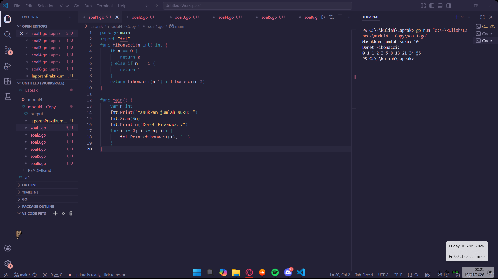
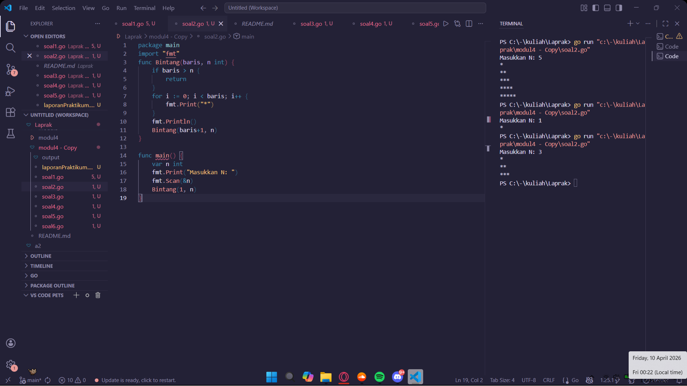
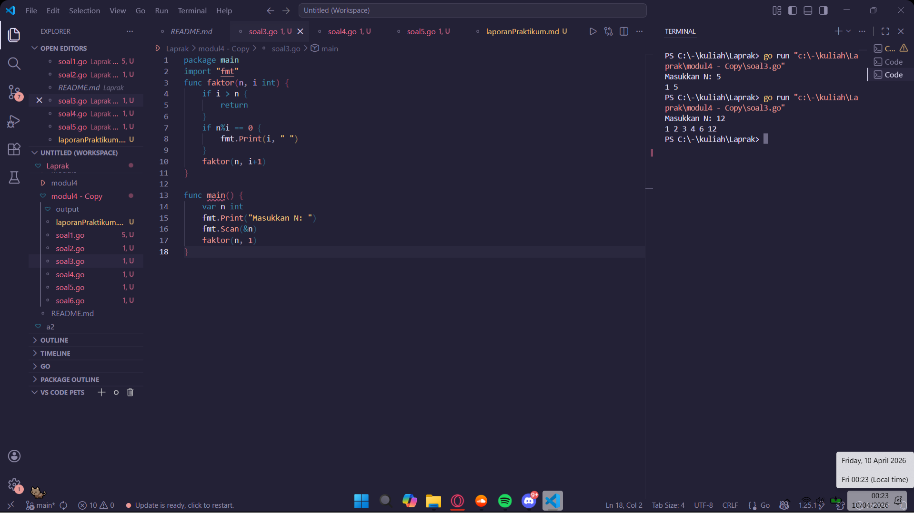
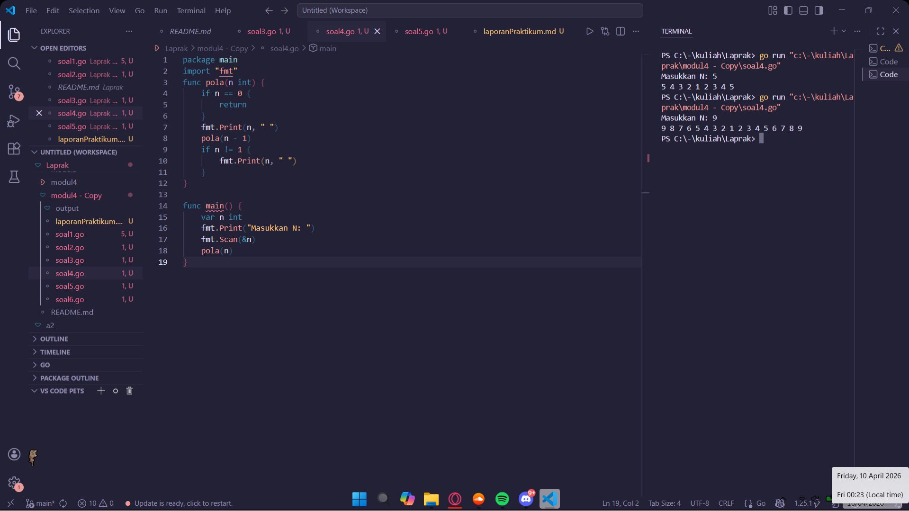
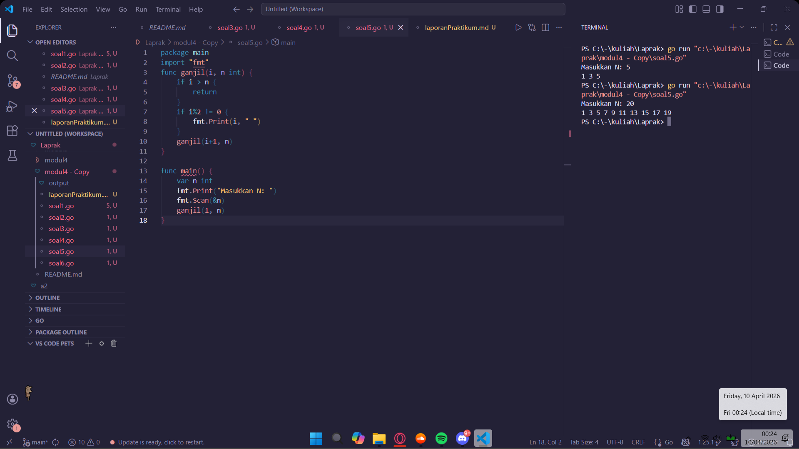
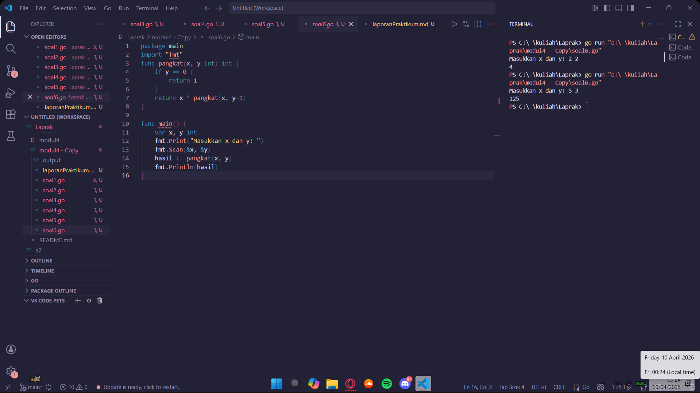

# <h1 align="center">Laporan Praktikum Modul 5 - REKURSIF </h1>
<p align="center">Satriya Wahyu Prakoso - 109082500219</p>

## Unguided 

### 1. Soal1
#### soal1.go

```go
package main
import "fmt"
func fibonacci(n int) int {
	if n == 0 {
		return 0
	} else if n == 1 {
		return 1
	}
	return fibonacci(n-1) + fibonacci(n-2)
}

func main() {
	var n int
	fmt.Print("Masukkan jumlah suku: ")
	fmt.Scan(&n)
	fmt.Println("Deret Fibonacci:")
	for i := 0; i <= n; i++ {
		fmt.Print(fibonacci(i), " ")
	}
}
```
### Output Unguided :

##### Output 


##### Penjelasan
Program ini digunakan untuk menampilkan deret Fibonacci sebanyak jumlah suku yang dimasukkan oleh pengguna. Program ditulis menggunakan bahasa Go.

package main digunakan agar program bisa dijalankan. import "fmt" digunakan untuk mengimpor fungsi input dan output. func main() adalah fungsi utama tempat program mulai dijalankan.

Fungsi fibonacci(n int) int digunakan untuk menghitung nilai Fibonacci ke-n. Di dalam fungsinya, Jika n == 0, maka fungsi mengembalikan nilai 0 dan Jika n == 1, maka fungsi mengembalikan nilai 1. Selain itu, fungsi akan mengembalikan hasil dari fibonacci(n-1) + fibonacci(n-2), sesuai dengan rumus deret Fibonacci. Setiap nilai Fibonacci dihitung berdasarkan penjumlahan dua nilai sebelumnya.

Pada bagian main, dibuat variabel n bertipe integer untuk menyimpan jumlah suku yang ingin ditampilkan. Program meminta input dari pengguna dengan fmt.Print, lalu membaca input menggunakan fmt.Scan(&n). Setelah itu, program menampilkan teks "Deret Fibonacci:". Kemudian dilakukan perulangan for i := 0; i <= n; i++ untuk mencetak deret Fibonacci dari suku ke-0 sampai suku ke-n.

Di dalam perulangan, fungsi fibonacci(i) dipanggil untuk menghitung setiap nilai, lalu hasilnya ditampilkan menggunakan fmt.Print.

### 2. Soal2
#### soal2.go

```go
package main
import "fmt"
func Bintang(baris, n int) {
	if baris > n {
		return
	}
	for i := 0; i < baris; i++ {
		fmt.Print("*")
	}
	fmt.Println()
	Bintang(baris+1, n)
}

func main() {
	var n int
	fmt.Print("Masukkan N: ")
	fmt.Scan(&n)
	Bintang(1, n)
}
```
### Output Unguided :

##### Output 


##### Penjelasan
Program ini digunakan untuk menampilkan pola bintang berbentuk segitiga ke bawah sesuai dengan jumlah baris yang dimasukkan oleh pengguna. Program ditulis menggunakan bahasa Go.

package main digunakan agar program bisa dijalankan. import "fmt" digunakan untuk mengimpor fungsi input dan output. func main() adalah fungsi utama tempat program mulai dijalankan.

Fungsi Bintang(baris, n int) digunakan untuk mencetak pola bintang. Di dalam fungsinya, Jika baris > n, maka fungsi akan berhenti dengan return. Jika belum melebihi n, maka program akan mencetak bintang sebanyak nilai baris.

Perulangan for i := 0; i < baris; i++ digunakan untuk mencetak tanda * dalam satu baris. Setelah itu, fmt.Println() digunakan untuk pindah ke baris berikutnya.

Fungsi kemudian memanggil dirinya sendiri dengan Bintang(baris+1, n) untuk mencetak baris selanjutnya dengan jumlah bintang yang lebih banyak.

Di bagian main, dibuat variabel n bertipe integer untuk menyimpan jumlah baris. Program meminta input dengan fmt.Print, lalu membaca input menggunakan fmt.Scan(&n). Setelah itu, fungsi Bintang(1, n) dipanggil untuk mulai mencetak pola dari baris pertama hingga baris ke-n. 

### 3. Soal3
#### soal3.go

```go
package main
import "fmt"
func faktor(n, i int) {
	if i > n {
		return
	}
	if n%i == 0 {
		fmt.Print(i, " ")
	}
	faktor(n, i+1)
}

func main() {
	var n int
	fmt.Print("Masukkan N: ")
	fmt.Scan(&n)
	faktor(n, 1)
}
```
### Output Unguided :

##### Output 


##### Deskripsi Program
Program ini digunakan untuk menampilkan faktor-faktor dari suatu bilangan yang dimasukkan oleh pengguna. Program ditulis menggunakan bahasa Go.

package main digunakan agar program bisa dijalankan. import "fmt" digunakan untuk mengimpor fungsi input dan output. func main() adalah fungsi utama tempat program mulai dijalankan.

Fungsi faktor(n, i int) digunakan untuk mencari dan mencetak faktor dari bilangan n. Di dalam fungsinya, Jika i > n, maka fungsi akan berhenti dengan return. Jika n % i == 0, artinya i adalah faktor dari n, sehingga nilai i akan dicetak menggunakan fmt.Print(i, " "). Setelah itu, fungsi memanggil dirinya sendiri dengan faktor(n, i+1) untuk mengecek bilangan berikutnya. Fungsi akan memeriksa semua bilangan dari 1 sampai n untuk menentukan apakah termasuk faktor dari n.

Di bagian main, dibuat variabel n bertipe integer untuk menyimpan input dari pengguna. Program meminta input menggunakan fmt.Print, lalu membaca input dengan fmt.Scan(&n). Setelah itu, fungsi faktor(n, 1) dipanggil untuk mulai mencari faktor dari 1 hingga n.

### 4. Soal4
#### soal4.go

```go
package main
import "fmt"
func pola(n int) {
	if n == 0 {
		return
	}
	fmt.Print(n, " ")
	pola(n - 1)
	if n != 1 {
		fmt.Print(n, " ")
	}
}

func main() {
	var n int
	fmt.Print("Masukkan N: ")
	fmt.Scan(&n)
	pola(n)
}
```
### Output Unguided :

##### Output 


##### Deskripsi Program
Program ini digunakan untuk menampilkan pola bilangan naik-turun (seperti cermin) berdasarkan nilai yang dimasukkan oleh pengguna. Program ditulis menggunakan bahasa Go.

package main digunakan agar program bisa dijalankan. import "fmt" digunakan untuk mengimpor fungsi input dan output. func main() adalah fungsi utama tempat program mulai dijalankan.

Fungsi pola(n int) digunakan untuk mencetak pola bilangan. Di dalam fungsinya, jika n == 0, maka fungsi akan berhenti dengan return. Jika belum berhenti, program akan mencetak nilai n menggunakan fmt.Print(n, " "). Setelah itu, fungsi memanggil dirinya sendiri dengan pola(n - 1) untuk mencetak bilangan yang lebih kecil.

Setelah pemanggilan rekursif selesai, terdapat kondisi if n != 1, maka nilai n akan dicetak kembali. Fungsi akan mencetak bilangan dari n turun ke 1, lalu naik kembali ke n.

Di bagian main, dibuat variabel n bertipe integer untuk menyimpan input dari pengguna. Program meminta input menggunakan fmt.Print, lalu membaca input dengan fmt.Scan(&n). Setelah itu, fungsi pola(n) dipanggil untuk menampilkan pola bilangan sesuai dengan nilai yang dimasukkan.

### 5. Soal5
#### soal5.go

```go
package main
import "fmt"
func ganjil(i, n int) {
	if i > n {
		return
	}
	if i%2 != 0 {
		fmt.Print(i, " ")
	}
	ganjil(i+1, n)
}

func main() {
	var n int
	fmt.Print("Masukkan N: ")
	fmt.Scan(&n)
	ganjil(1, n)
}
```
### Output Unguided :

##### Output 


##### Deskripsi Program
Program ini digunakan untuk menampilkan bilangan ganjil dari 1 sampai nilai yang dimasukkan oleh pengguna. Program ditulis menggunakan bahasa Go.

package main digunakan agar program bisa dijalankan. import "fmt" digunakan untuk mengimpor fungsi input dan output. func main() adalah fungsi utama tempat program mulai dijalankan.

Fungsi ganjil(i, n int) digunakan untuk mencari dan mencetak bilangan ganjil dalam rentang dari i sampai n. Di dalam fungsinya, jika i > n, maka fungsi akan berhenti dengan return. Jika i % 2 != 0, artinya i adalah bilangan ganjil, sehingga nilai i akan dicetak menggunakan fmt.Print(i, " "). Setelah itu, fungsi memanggil dirinya sendiri dengan ganjil(i+1, n) untuk mengecek bilangan berikutnya. Fungsi akan memeriksa semua bilangan dari 1 sampai n untuk menentukan mana yang termasuk bilangan ganjil.

Di bagian main, dibuat variabel n bertipe integer untuk menyimpan input dari pengguna. Program meminta input menggunakan fmt.Print, lalu membaca input dengan fmt.Scan(&n). Setelah itu, fungsi ganjil(1, n) dipanggil untuk mulai mencetak bilangan ganjil dari 1 hingga n.

### 6. Soal6
#### soal6.go

```go
package main
import "fmt"
func pangkat(x, y int) int {
	if y == 0 {
		return 1
	}
	return x * pangkat(x, y-1)
}

func main() {
	var x, y int
	fmt.Print("Masukkan x dan y: ")
	fmt.Scan(&x, &y)
	hasil := pangkat(x, y)
	fmt.Println(hasil)
}
```
### Output Unguided :

##### Output 


##### Deskripsi Program
Program ini digunakan untuk menghitung hasil perpangkatan suatu bilangan berdasarkan nilai yang dimasukkan oleh pengguna. Program ditulis menggunakan bahasa Go.

package main digunakan agar program bisa dijalankan. import "fmt" digunakan untuk mengimpor fungsi input dan output. func main() adalah fungsi utama tempat program mulai dijalankan.

Fungsi pangkat(x, y int) int digunakan untuk menghitung nilai x pangkat y. Di dalam fungsinya, jika y == 0, maka fungsi akan mengembalikan nilai 1. Setiap bilangan yang dipangkatkan 0 hasilnya adalah 1. Jika tidak, maka fungsi akan mengembalikan hasil dari x * pangkat(x, y-1). Nilai x akan dikalikan terus menerus sebanyak y kali melalui pemanggilan fungsi secara berulang. Fungsi akan menghitung x^y secara bertahap sampai mencapai kondisi berhenti.

Di bagian main, dibuat variabel x dan y bertipe integer untuk menyimpan input dari pengguna. Program meminta input menggunakan fmt.Print, lalu membaca input dengan fmt.Scan(&x, &y). Setelah itu, fungsi pangkat(x, y) dipanggil dan hasilnya disimpan ke dalam variabel hasil.

Hasil perhitungan kemudian ditampilkan menggunakan fmt.Println.