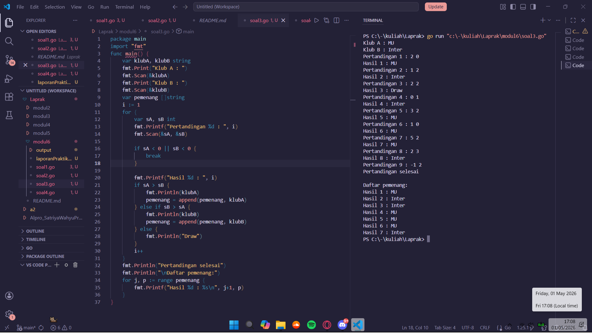

# <h1 align="center">Laporan Praktikum Modul 9 - ARRAY </h1>
<p align="center">Satriya Wahyu Prakoso - 109082500219</p>

## Unguided 

### 1. Soal1
#### soal1.go

```go
package main
import (
	"fmt"
	"math"
)
type Titik struct {
	x, y int
}

type Lingkaran struct {
	pusat Titik
	r     int
}

func jarak(p, q Titik) float64 {
	return math.Sqrt(float64((p.x-q.x)*(p.x-q.x) + (p.y-q.y)*(p.y-q.y)))
}

func didalam(c Lingkaran, p Titik) bool {
	return jarak(p, c.pusat) <= float64(c.r)
}

func main() {
	var l1, l2 Lingkaran
	var t Titik
	fmt.Scan(&l1.pusat.x, &l1.pusat.y, &l1.r)
	fmt.Scan(&l2.pusat.x, &l2.pusat.y, &l2.r)
	fmt.Scan(&t.x, &t.y)
	in1 := didalam(l1, t)
	in2 := didalam(l2, t)
	switch {
	case in1 && in2:
		fmt.Println("Titik di dalam lingkaran 1 dan 2")
	case in1:
		fmt.Println("Titik di dalam lingkaran 1")
	case in2:
		fmt.Println("Titik di dalam lingkaran 2")
	default:
		fmt.Println("Titik di luar lingkaran 1 dan 2")
	}
}
```
### Output Unguided :

##### Output 
.png)

.png)

##### Penjelasan
Program ini digunakan untuk menentukan posisi sebuah titik terhadap dua lingkaran, apakah titik tersebut berada di dalam lingkaran 1, lingkaran 2, keduanya, atau di luar keduanya. Program ditulis menggunakan bahasa Go.

package main digunakan agar program bisa dijalankan. import "fmt" digunakan untuk input dan output, sedangkan import "math" digunakan untuk perhitungan matematika, khususnya akar kuadrat.

Tipe data Titik digunakan untuk menyimpan koordinat suatu titik dengan atribut x dan y. Tipe data Lingkaran digunakan untuk menyimpan sebuah lingkaran yang terdiri dari titik pusat (pusat) dan jari-jari (r).

Fungsi jarak(p, q Titik) float64 digunakan untuk menghitung jarak antara dua titik menggunakan rumus Euclidean. Di dalam fungsi ini, jarak dihitung dengan rumus akar dari (x1−x2)^2 + (y1−y2)^2, lalu hasilnya dikembalikan dalam bentuk float64.

Fungsi didalam(c Lingkaran, p Titik) bool digunakan untuk mengecek apakah suatu titik berada di dalam lingkaran. Fungsi ini memanggil fungsi jarak untuk menghitung jarak antara titik dan pusat lingkaran. Jika jarak tersebut kurang dari atau sama dengan jari-jari lingkaran, maka fungsi mengembalikan nilai true, yang berarti titik berada di dalam lingkaran.

Pada bagian main, dibuat variabel l1 dan l2 bertipe Lingkaran untuk menyimpan dua lingkaran, serta variabel t bertipe Titik untuk menyimpan titik yang akan dicek. Program kemudian membaca input dari pengguna menggunakan fmt.Scan, yaitu koordinat pusat dan jari-jari untuk masing-masing lingkaran, serta koordinat titik.

Setelah itu, dilakukan pengecekan dengan memanggil fungsi didalam untuk masing-masing lingkaran, dan hasilnya disimpan dalam variabel in1 dan in2.

Selanjutnya, digunakan struktur switch tanpa kondisi untuk menentukan output. Jika in1 dan in2 bernilai true, maka titik berada di dalam kedua lingkaran. Jika hanya in1 yang true, maka titik berada di dalam lingkaran 1. Jika hanya in2 yang true, maka titik berada di dalam lingkaran 2. Jika keduanya false, maka titik berada di luar kedua lingkaran.

Terakhir, program menampilkan hasil sesuai kondisi menggunakan fmt.Println.

### 2. Soal2
#### soal2.go

```go
package main
import (
	"fmt"
	"math"
)
func main() {
	var n int
	fmt.Print("Masukkan jumlah elemen: ")
	fmt.Scan(&n)

	arr := make([]int, n)
	fmt.Print("Masukkan elemen: ")
	for i := 0; i < n; i++ {
		fmt.Scan(&arr[i])
	}

	fmt.Print("a. Semua elemen: ")
	for _, v := range arr {
		fmt.Print(v, " ")
	}
	fmt.Println()

	fmt.Print("b. Indeks ganjil: ")
	for i := 1; i < n; i += 2 {
		fmt.Print(arr[i], " ")
	}
	fmt.Println()

	fmt.Print("c. Indeks genap: ")
	for i := 0; i < n; i += 2 {
		fmt.Print(arr[i], " ")
	}
	fmt.Println()

	var x int
	fmt.Print("d. Masukkan x (kelipatan): ")
	fmt.Scan(&x)
	fmt.Print("   Indeks kelipatan ", x, ": ")
	for i := 0; i < n; i++ {
		if i%x == 0 {
			fmt.Print(arr[i], " ")
		}
	}
	fmt.Println()

	var hapus int
	fmt.Print("e. Masukkan indeks yang dihapus: ")
	fmt.Scan(&hapus)
	arrHapus := append(arr[:hapus], arr[hapus+1:]...)
	fmt.Print("   Array setelah dihapus: ")
	for _, v := range arrHapus {
		fmt.Print(v, " ")
	}
	fmt.Println()

	sum := 0
	for _, v := range arr {
		sum += v
	}
	rata := float64(sum) / float64(n)
	fmt.Printf("f. Rata-rata: %.2f\n", rata)

	varSum := 0.0
	for _, v := range arr {
		varSum += math.Pow(float64(v)-rata, 2)
	}
	stdDev := math.Sqrt(varSum / float64(n))
	fmt.Printf("g. Standar deviasi: %.2f\n", stdDev)

	var cari int
	fmt.Print("h. Masukkan bilangan yang dicari frekuensinya: ")
	fmt.Scan(&cari)
	freq := 0
	for _, v := range arr {
		if v == cari {
			freq++
		}
	}
	fmt.Printf("   Frekuensi %d: %d\n", cari, freq)
}
```
### Output Unguided :

##### Output 
.png)

.png)

.png)

##### Penjelasan

Program ini digunakan untuk mengolah data dalam bentuk array (slice) yang diinput oleh pengguna, kemudian menampilkan berbagai informasi seperti elemen array, indeks tertentu, penghapusan elemen, rata-rata, standar deviasi, dan frekuensi suatu nilai. Program ditulis menggunakan bahasa Go.

package main digunakan agar program bisa dijalankan. import "fmt" digunakan untuk input dan output, sedangkan import "math" digunakan untuk perhitungan matematika seperti pangkat dan akar.

Pada fungsi main, pertama dibuat variabel n bertipe integer untuk menyimpan jumlah elemen array. Program meminta input dari pengguna dengan fmt.Print, lalu membaca nilai n menggunakan fmt.Scan(&n).

Selanjutnya dibuat array arr dengan panjang n menggunakan make([]int, n). Program kemudian meminta pengguna memasukkan elemen array satu per satu menggunakan perulangan for.

Bagian (a) digunakan untuk menampilkan semua elemen array. Perulangan for _, v := range arr digunakan untuk mencetak setiap elemen.

Bagian (b) digunakan untuk menampilkan elemen pada indeks ganjil. Perulangan dimulai dari indeks 1 dan bertambah 2 setiap iterasi (i += 2), sehingga hanya indeks ganjil yang ditampilkan.

Bagian (c) digunakan untuk menampilkan elemen pada indeks genap. Perulangan dimulai dari indeks 0 dan bertambah 2 setiap iterasi.

Pada bagian (d), program meminta input nilai x, lalu menampilkan elemen yang berada pada indeks kelipatan x. Pengecekan dilakukan dengan kondisi i % x == 0.

Pada bagian (e), program meminta input indeks yang ingin dihapus. Elemen pada indeks tersebut dihapus dengan menggunakan append(arr[:hapus], arr[hapus+1:]...), kemudian hasil array baru ditampilkan.

Bagian (f) digunakan untuk menghitung rata-rata. Semua elemen dijumlahkan terlebih dahulu ke dalam variabel sum, lalu dibagi dengan jumlah elemen n dan dikonversi ke tipe float64.

Bagian (g) digunakan untuk menghitung standar deviasi. Program menghitung selisih setiap elemen dengan rata-rata, kemudian dikuadratkan menggunakan math.Pow, dijumlahkan, dibagi dengan n, lalu diakar menggunakan math.Sqrt.

Pada bagian (h), program meminta input sebuah bilangan yang ingin dicari frekuensinya. Program kemudian menghitung berapa kali bilangan tersebut muncul di dalam array menggunakan perulangan, dan hasilnya ditampilkan.

### 3. Soal3
#### soal3.go

```go
package main
import "fmt"
func main() {
	var klubA, klubB string
	fmt.Print("Klub A : ")
	fmt.Scan(&klubA)
	fmt.Print("Klub B : ")
	fmt.Scan(&klubB)
	var pemenang []string
	i := 1
	for {
		var sA, sB int
		fmt.Printf("Pertandingan %d : ", i)
		fmt.Scan(&sA, &sB)

		if sA < 0 || sB < 0 {
			break
		}

		fmt.Printf("Hasil %d : ", i)
		if sA > sB {
			fmt.Println(klubA)
			pemenang = append(pemenang, klubA)
		} else if sB > sA {
			fmt.Println(klubB)
			pemenang = append(pemenang, klubB)
		} else {
			fmt.Println("Draw")
		}
		i++
	}
	fmt.Println("Pertandingan selesai")
	fmt.Println("\nDaftar pemenang:")
	for j, p := range pemenang {
		fmt.Printf("Hasil %d : %s\n", j+1, p)
	}
}
```
### Output Unguided :

##### Output 


##### Deskripsi Program

Program ini digunakan untuk mencatat hasil beberapa pertandingan antara dua klub, lalu menampilkan pemenang dari setiap pertandingan serta daftar seluruh pemenang. Program ditulis menggunakan bahasa Go.

package main digunakan agar program bisa dijalankan. import "fmt" digunakan untuk melakukan input dan output.

Pada fungsi main, pertama dibuat variabel klubA dan klubB bertipe string untuk menyimpan nama dua klub. Program meminta input nama klub menggunakan fmt.Print, lalu membacanya dengan fmt.Scan.

Selanjutnya dibuat slice pemenang bertipe []string untuk menyimpan nama klub yang memenangkan setiap pertandingan. Variabel i digunakan sebagai penanda nomor pertandingan, dimulai dari 1.

Program kemudian menggunakan perulangan tak hingga for {} untuk memasukkan skor pertandingan. Pada setiap iterasi, dibuat variabel sA dan sB bertipe integer untuk menyimpan skor masing-masing klub. Input skor dilakukan dengan fmt.Scan(&sA, &sB).

Jika salah satu skor bernilai negatif (sA < 0 || sB < 0), maka perulangan dihentikan dengan break, yang menandakan tidak ada pertandingan lagi.

Jika skor valid, program menentukan pemenang:

Jika sA > sB, maka klub A menang, ditampilkan, dan disimpan ke dalam slice pemenang.
Jika sB > sA, maka klub B menang, ditampilkan, dan disimpan ke dalam slice pemenang.
Jika kedua skor sama, maka hasilnya "Draw" dan tidak disimpan ke dalam slice.

Setelah setiap pertandingan, nilai i ditambahkan (i++) untuk melanjutkan ke pertandingan berikutnya.

Setelah perulangan selesai, program menampilkan pesan "Pertandingan selesai", lalu mencetak daftar pemenang. Perulangan for j, p := range pemenang digunakan untuk menampilkan setiap pemenang beserta nomor hasilnya.

### 4. Soal4
#### soal4.go

```go
package main
import "fmt"
const NMAX int = 127
type tabel [NMAX]rune
func isiArray(t *tabel, n *int) {
	var ch rune
	*n = 0
	for {
		fmt.Scanf("%c", &ch)
		if ch == '.' {
			break
		}
		if ch == ' ' || ch == '\n' || ch == '\r' {
			continue
		}
		t[*n] = ch
		*n++
		if *n >= NMAX {
			break
		}
	}
}

func cetakArray(t tabel, n int) {
	for i := 0; i < n; i++ {
		fmt.Printf("%c ", t[i])
	}
	fmt.Println()
}

func balikanArray(t *tabel, n int) {
	for i, j := 0, n-1; i < j; i, j = i+1, j-1 {
		t[i], t[j] = t[j], t[i]
	}
}

func palindrom(t tabel, n int) bool {
	for i := 0; i < n/2; i++ {
		if t[i] != t[n-1-i] {
			return false
		}
	}
	return true
}

func main() {
	var tab tabel
	var m int
	fmt.Print("Teks        : ")
	isiArray(&tab, &m)
	original := tab
	fmt.Print("Reverse teks: ")
	balikanArray(&tab, m)
	cetakArray(tab, m)
	fmt.Print("Palindrom   ? ")
	fmt.Println(palindrom(original, m))
}
```
### Output Unguided :

##### Output 
.png)

.png)

##### Deskripsi Program

Program ini digunakan untuk membaca sebuah teks karakter, menyimpannya ke dalam array, kemudian membalik urutan karakter tersebut dan mengecek apakah teks tersebut merupakan palindrom atau bukan. Program ditulis menggunakan bahasa Go.

package main digunakan agar program bisa dijalankan. import "fmt" digunakan untuk melakukan input dan output.

Konstanta NMAX digunakan untuk menentukan kapasitas maksimum array, yaitu 127 karakter. Tipe data tabel didefinisikan sebagai array dengan ukuran NMAX yang berisi tipe data rune, yaitu untuk menyimpan karakter.

Fungsi isiArray(t *tabel, n *int) digunakan untuk membaca input karakter satu per satu. Karakter dibaca menggunakan fmt.Scanf("%c", &ch). Jika karakter yang dibaca adalah titik ('.'), maka input berhenti. Jika karakter berupa spasi, newline, atau carriage return, maka akan dilewati. Karakter yang valid disimpan ke dalam array t, dan jumlah elemen disimpan dalam variabel n. Proses berhenti jika jumlah elemen mencapai batas maksimum.

Fungsi cetakArray(t tabel, n int) digunakan untuk menampilkan isi array sebanyak n elemen. Setiap karakter dicetak menggunakan perulangan for, lalu ditampilkan dengan format %c.

Fungsi balikanArray(t *tabel, n int) digunakan untuk membalik urutan isi array. Proses dilakukan dengan menukar elemen dari depan dan belakang secara berpasangan hingga mencapai tengah array.

Fungsi palindrom(t tabel, n int) bool digunakan untuk mengecek apakah array membentuk palindrom. Fungsi ini membandingkan elemen dari depan dengan elemen dari belakang. Jika semua pasangan sama, maka fungsi mengembalikan true, jika tidak maka false.

Pada bagian main, dibuat variabel tab bertipe tabel untuk menyimpan karakter, dan variabel m untuk menyimpan jumlah elemen. Program meminta input teks dari pengguna, lalu memanggil fungsi isiArray untuk mengisinya.

Selanjutnya, isi array asli disimpan ke dalam variabel original agar tidak berubah saat dibalik. Program kemudian memanggil fungsi balikanArray untuk membalik isi array, lalu menampilkannya dengan cetakArray.

Terakhir, program mengecek apakah teks awal merupakan palindrom dengan memanggil fungsi palindrom(original, m), dan hasilnya ditampilkan ke layar.